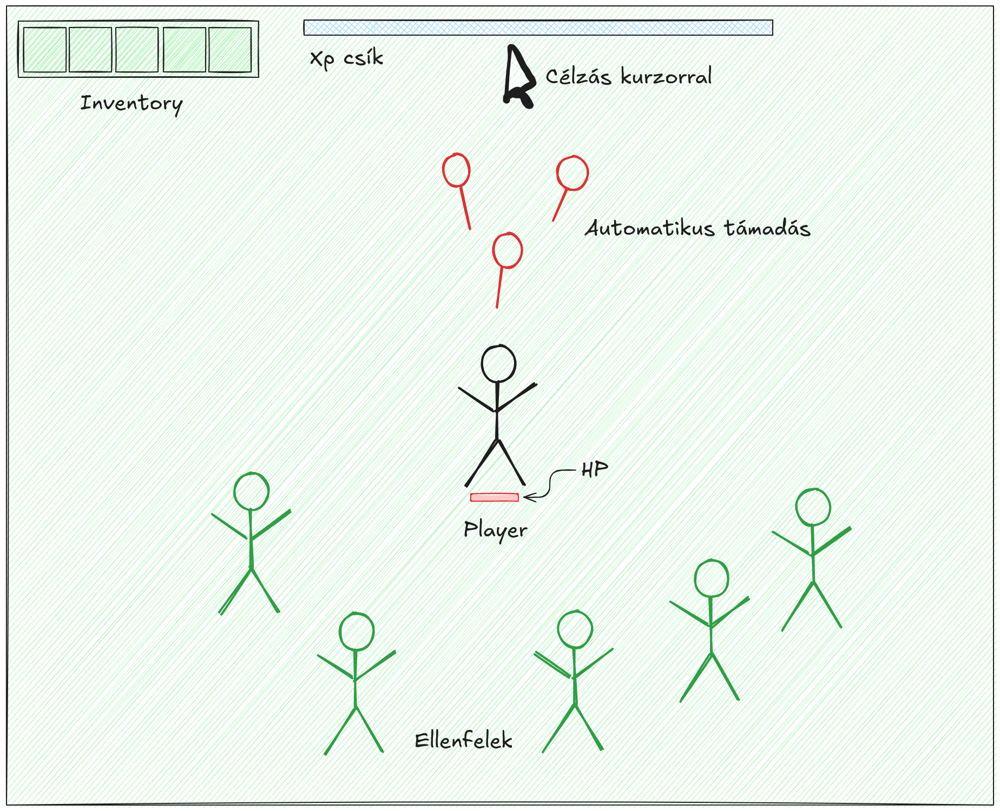

**Game Design Document**  
**Játék címe:** Shadowspawn (Nem végleges)
**Fejlesztők:** Garbage Collector  
**Csapattagok:** 
 - Csákó Balázs, 
 - Harsányi Balázs, 
 - Kiss Konrád Soma, 
 - Tóth Tamás

**Dátum:** 2024. 12. 03.
**Verzió:** 1.0

---

### 1. **Áttekintés és játékmenet**  
**Leírás:**  
A játék egy survival action game, ahol a játékos karakter folyamatosan támad automatikusan, miközben ellenségek hullámait kell legyőznie. A cél minél tovább túlélni, miközben a játékos power-upokat gyűjt, amelyek erősítik a karakter képességeit.  

(A Vampire Survivors alapján készült, de egyszerűsített változat.)

**Irányítás:**  
- **Mozgás:** WASD billentyűk vagy nyílbillentyűk.  
- **Interakciók:** Egérrel vezérelt menükezelés, célzás.

**Fő játékelemek:**  
- Automatikus támadás: A karakter támadási mintái előre meghatározottak, a játékos mozgással próbálja kikerülni az ellenségeket.
- Ellenségek: Folyamatosan érkező, egyre nehezedő hullámok. Egyszerűen a játékos fele haladnak, egymással ütköznek.
- Power-upok: Gyűjthető tárgyak, amelyeket "szintlépésénként" kap a játékos, valamilyen támadási vagy gyógyulási hatással. 
- Egyszerű pontszám-rendszer, ami mutatja, meddig sikerült túlélni, illetve számolja a szintlépés határokat.

---

### 2. **Vizuális stílus és hangzás**  
**Vizuális stílus:**  
- Pixel art alapú grafika.  
- Fix színpaletta alkalmazása az egyszerűség kedvéért.  

**Hangzás:**  
- Alapvető hanghatások: támadások, ütközések és ellenségek elpusztítása.  
- Minimalista háttérzene.  

---

### 3. **Assetek**  
**Szükséges grafikai elemek:**  
- **Játékos karakter**: 2-3 animációs állapot (pl. mozgás).  
- **Ellenségek**: Legalább 4-5 típus. (+ 1-2 elit) (Nem igényelnek animációt, procedurálisan mozognak.)
- **Power-up ikonok**: 6-7 egyszerű grafika. 
- **Támadások**: Egyszerű, animáció nélküli grafika. (Tűzgömb, stb.) 
- **Háttér**: Egyszerű ismétlődő textúra, amely folytonos, "végtelen" térképet alkot.  
- **GUI elemek**: Életerőcsík, időzítő, pontszám.  

**Szükséges hangok:**  
- Támadás hangja.  
- Ütközés/ellenség elpusztításának hangja.  
- Power-up felvétele.  
- Egyszerű háttérzene.  

---

### 4. **A fejlesztés részei**  
0. **Alap prototípus:**  (Kész)
   - Egy közös branch-en egy minimális működő verzió, ami tartalmazza:  
     - A beállított javascript projektet egy megnyíló üres Phaser.js canvas-al.

1. **Mozgás és vezérlés:** (Konrád)
   - Játékos WASD/nyilak általi mozgatása.  
   - Végtelenül ismétlődő térkép implementálása (folytonos scrollozás, ha túl messze megyünk mindent visszateleportálunk középre úgy hogy ne látszódjon).

2. **Támadási rendszer:** (Konrád)
   - Automatikus támadási mechanika létrehozása.  
   - Egy alap fegyverrel kezdünk.

3. **Ellenségek és hullámok:** (Cs. Balázs) 
   - Ellenségek generálása és mozgásmintáik megírása.  

4. **Power-up rendszer:** (Cs. Balázs, Konrád polisholt) 
   - Szintlépés megírása.
   - Power-up tárgyak megjelenése és hatásaik implementálása. (3 közül választható szintlépésenként, végtelen alkalommal fejleszthetőek de csak 4 választható (össz. 5), utána új nem jelenik meg.)  

5. **Felhasználói felület (UI):** (Konrád, Tamás és H. Balázs segített/tervezett) 
   - Pontszám, életerőcsík, inventory és egyéb vizuális elemek.  

6. **Hangok és finomhangolás:** (Hangok kimaradt, Konrád írta, Tamás és H. Balázs segített/tervezett) 
   - Hangok hozzáadása és a játék optimalizálása.  

---  
